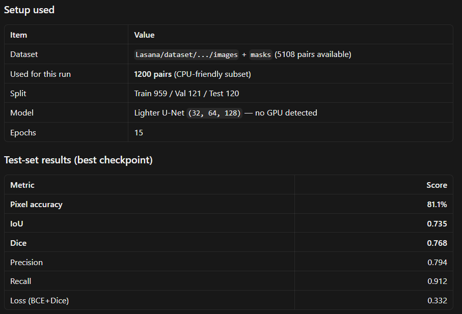
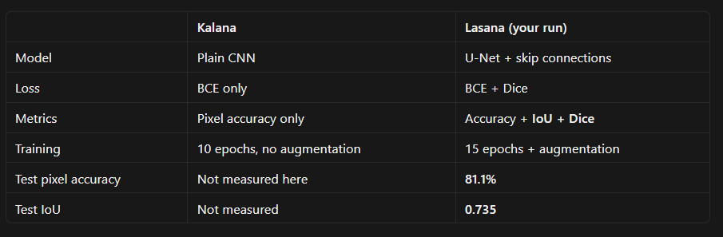
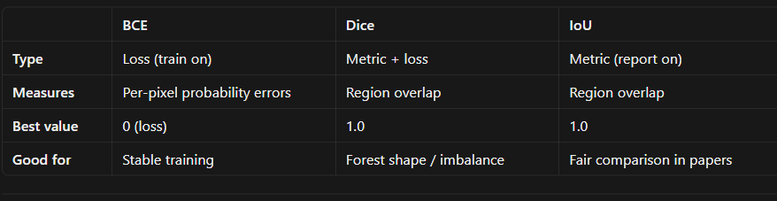
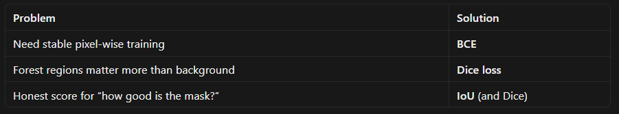

# Lasana — Improved Forest Segmentation Baseline

This folder upgrades the simple CNN in `Notebooks/Kalana` into a stronger, research-style baseline for **binary forest / non-forest semantic segmentation** from satellite images.

| Item | Details |
|------|---------|
| **Notebook** | `improved_forest_segmentation.ipynb` |
| **Framework** | TensorFlow / Keras (same stack as Kalana, easier to compare) |
| **Model** | U-Net with BatchNorm + skip connections |
| **Dataset** | Forest Segmented (`images/` + `masks/`, names like `*_sat_*` / `*_mask_*`) |
| **Task** | Per-pixel classification: forest = 1, background = 0 |

---

## Visual reference (`docs/`)

Quick-reference images for what changed, what was used, and how metrics differ.

### Training setup & test results



CPU run on 1,200 pairs from `Lasana/dataset/` — lighter U-Net, 15 epochs, 80/10/10 split.

### Kalana vs Lasana — what changed



Architecture, loss, metrics, and training differences between the two baselines.

### BCE, Dice, and IoU — what each does



| | BCE | Dice | IoU |
|---|-----|------|-----|
| **Type** | Loss (train on) | Metric + loss | Metric (report on) |
| **Measures** | Per-pixel probability errors | Region overlap | Region overlap |
| **Best value** | 0 (loss) | 1.0 | 1.0 |

### Which metric for which problem



- **BCE** → stable pixel-wise training  
- **Dice loss** → forest regions matter more than background  
- **IoU / Dice** → honest mask quality score  

---

## Why this folder exists

Kalana’s `main.py` is intentionally minimal:

- plain encoder–decoder (no skip connections)
- binary cross-entropy only
- pixel accuracy only
- no augmentation
- 10 epochs

That is good for learning the idea of segmentation, but it underperforms on real satellite masks. **Lasana** applies the improvements that usually matter most for this problem, with clear reasons for each choice.

---

## Problem recap

**Input:** RGB satellite patch (256×256×3)  
**Output:** Binary mask (256×256×1) — forest vs non-forest  

The network must label *every pixel*, not just assign one class to the whole image. Boundaries, small clearings, and class imbalance all matter.

---

## What we changed vs Kalana (and why)

### 1. U-Net architecture (instead of a plain CNN)

**What it does**

- **Encoder:** downsamples and extracts features (64 → 128 → 256 → 512).
- **Bottleneck:** deepest representation.
- **Decoder:** upsamples back to full resolution.
- **Skip connections:** concatenate matching encoder feature maps into the decoder.

**Why we use it**

Pooling throws away fine spatial detail. Without skips, the decoder must rebuild edges from a coarse map and often blurs forest boundaries. Skip connections restore high-resolution cues (edges, texture), which is why U-Net is the standard baseline for biomedical and remote-sensing segmentation (Ronneberger et al., 2015).

**Also added: Batch Normalization**

Stabilizes training, allows higher learning rates, and usually improves convergence compared with Kalana’s BN-free stack.

---

### 2. BCE + Dice loss (instead of BCE alone)

**What it does**

```text
Loss = 0.5 × Binary Cross-Entropy + 0.5 × Dice Loss
```

- **BCE:** penalizes wrong per-pixel probabilities.
- **Dice:** directly optimizes overlap between predicted and true forest regions.

**Why we use it**

Pixel accuracy / BCE can look good if most pixels are background (predict “all background” and accuracy stays high). Dice focuses on the forest region itself, so the model is pushed to get the *shape* of forest right, not just the majority class.

---

### 3. IoU and Dice metrics (instead of pixel accuracy alone)

| Metric | Meaning |
|--------|---------|
| **Pixel accuracy** | Fraction of correctly labeled pixels (easy to inflate) |
| **IoU (Jaccard)** | `TP / (TP + FP + FN)` — overlap quality |
| **Dice** | `2·TP / (2·TP + FP + FN)` — similar to IoU, common in segmentation papers |
| **Precision / Recall** | How clean / complete forest predictions are |

**Why we use them**

We still print pixel accuracy for comparison with Kalana, but **model selection and reporting should use IoU / Dice**. Those match what matters for vegetation cover maps.

---

### 4. Correct mask preprocessing

| Step | Kalana | Lasana | Why |
|------|--------|--------|-----|
| Resize masks | default (bilinear-like) | `INTER_NEAREST` | Soft interpolation creates gray “in-between” pixels on boundaries |
| Binarize | `/ 255.0` only | threshold at **127** then 0/1 | JPEG masks are not perfectly 0/255; thresholding cleans compression noise |

Images still use bilinear resize and `/255` normalization (or ImageNet-style scaling in the notebook comments if you extend further).

---

### 5. Data augmentation

**What we apply (training only)**

- horizontal / vertical flips
- random 90° rotations
- mild brightness / contrast jitter

**Why we use it**

Satellite patches vary in orientation and lighting. Augmentation increases effective dataset size and reduces overfitting without collecting new labels. Validation and test sets are **not** augmented so metrics stay honest.

---

### 6. Stronger training recipe

| Setting | Kalana | Lasana | Why |
|---------|--------|--------|-----|
| Split | 80% train / 20% test | **80 / 10 / 10** train / val / test | Val for early stopping; held-out test for final report |
| Epochs | 10 | up to **50** + early stopping | Enough time to converge; stop when val IoU stalls |
| Batch size | 8 | **8–16** (GPU-dependent) | Stable gradients; raise if memory allows |
| Optimizer | Adam | Adam + **ReduceLROnPlateau** | Lower LR when val IoU plateaus |
| Checkpoint | last model | **best val IoU** | Don’t keep an overfit late epoch |

---

## Folder layout

```text
Lasana/
  README.md                              ← this file
  improved_forest_segmentation.ipynb     ← run this
  train_lasana.py                        ← script version of the notebook
  docs/                                  ← visual summaries (see above)
  checkpoints/                           ← created when you train (best weights)
  results/                               ← curves / prediction grids (created on run)
  dataset/                               ← Forest Segmented data (gitignored)
```

### Recommended dataset layout

Place the Forest Segmented data so the notebook can find it. Either:

**Option A — next to this folder**

```text
DNN_Project/
  Lasana/
  data/
    Forest Segmented/
      Forest Segmented/
        images/
        masks/
        meta_data.csv   (optional)
```

**Option B — local copies inside Lasana**

```text
Lasana/
  images/
  masks/
```

Edit the path cell at the top of the notebook if your folders live elsewhere.

### Filename convention

- Image: `242583_sat_08.jpg`
- Mask:  `242583_mask_08.jpg`

The notebook maps `_sat_` → `_mask_` the same way Kalana does.

---

## How to run

1. Install dependencies (Python 3.9+ recommended):

```bash
pip install tensorflow numpy opencv-python-headless matplotlib scikit-learn
```

2. Open `improved_forest_segmentation.ipynb` in Jupyter / VS Code / Colab.

3. Set `IMAGE_FOLDER` and `MASK_FOLDER` in the config cell.

4. Run all cells top to bottom.

5. Check:

- printed train / val / test IoU & Dice
- plots under `results/`
- best weights under `checkpoints/`

**GPU tip:** training U-Net on CPU is slow. Prefer a local NVIDIA GPU or Google Colab (Runtime → GPU).

---

## Expected outcome vs Kalana

Exact numbers depend on your split and hardware, but typically:

| Approach | What you should see |
|----------|---------------------|
| Kalana simple CNN | High pixel accuracy possible; **weaker IoU / blurry masks** |
| Lasana U-Net + BCE/Dice | **Higher IoU & Dice**, sharper forest boundaries |

If pixel accuracy barely changes but IoU jumps, that is success — you fixed the metric that was hiding poor forest overlap.

---

## Notebook section map

| Section | Purpose |
|---------|---------|
| Config & paths | Dataset location, image size, epochs, batch size |
| Data loading | Pair images/masks, nearest-neighbor mask resize, threshold |
| Augmentation | Keras `ImageDataGenerator`-style / `tf.image` flips & jitter |
| U-Net model | Encoder, bottleneck, decoder, skips, BatchNorm, sigmoid head |
| Losses & metrics | Soft Dice, BCE+Dice, IoU / Dice callbacks |
| Train | Fit with validation, LR schedule, early stopping, checkpoints |
| Evaluate | Test-set metrics + side-by-side image / GT / prediction plots |

Each major code cell in the notebook has a short markdown cell above it explaining **what** and **why**.

---

## Design choices we deliberately kept simple

- **No transfer learning yet** — keeps the upgrade comparable to Kalana and Dinura’s from-scratch U-Net.
- **Binary sigmoid head** — one forest class; multi-class vegetation would need softmax + categorical Dice.
- **TensorFlow/Keras** — matches Kalana so you can A/B the same data pipeline language.

Natural next steps after Lasana: pretrained encoder (ResNet/EfficientNet), Focal loss for heavy imbalance, test-time augmentation, or the PyTorch U-Net in `Notebooks/Dinura`.

---

## References (concepts used here)

1. Ronneberger et al., *U-Net: Convolutional Networks for Biomedical Image Segmentation*, MICCAI 2015 — skip-connection encoder–decoder.
2. Milletari et al., *V-Net*, 2016 — Dice loss for segmentation overlap.
3. Project Kalana baseline — minimal CNN teaching baseline this folder improves.
4. Project Dinura U-Net notebook — same task/metrics in PyTorch; Lasana is the Keras counterpart with the same improvement ideas.
