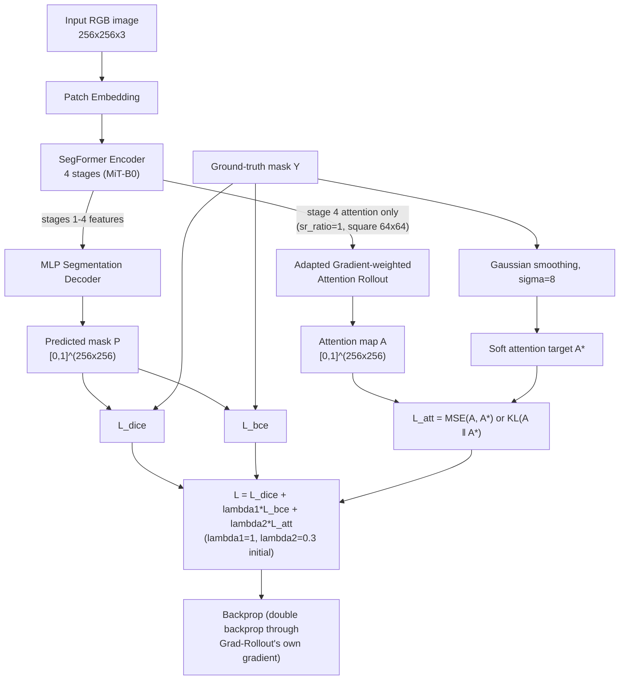

# 1. Introduction

## 1.1 Background and Motivation

Semantic segmentation of forest cover from aerial and satellite imagery
underpins ecological monitoring, deforestation tracking, and land-use
management. Convolutional architectures such as U-Net [9] have long
dominated this task, and more recently transformer-based models — SegFormer
[1] among them — have been applied for their ability to capture long-range
spatial dependencies. However, as detailed in Section 2, the great majority
of transformer segmentation work, including recent forest-specific studies
[6], [7], [8], uses attention purely as an architectural mechanism to
improve accuracy, and evaluates explainability — when it appears at all —
only through post-hoc qualitative heatmap inspection after training.

This project builds on a supervisor-suggested direction: use an existing
explainable-AI (XAI) method not merely to visualize what a trained model has
learned, but as part of the training process itself — turning attention into
a supervised training signal rather than a post-hoc artifact.

## 1.2 Problem Statement

Transformer attention in segmentation models is not explicitly guided during
training and frequently attends to task-irrelevant regions such as roads,
shadows, and buildings rather than the class of interest. This reduces both
segmentation accuracy at ambiguous boundaries and the trustworthiness of the
model's explanations. No existing work addresses this specifically for
forest/non-forest segmentation, nor evaluates attention faithfulness
quantitatively in this domain (Section 2.3).

## 1.3 Research Objectives

- Design an Attention Consistency Loss that supervises SegFormer-B0's
  internal attention against the ground-truth forest mask during training.
- Adapt Gradient-weighted Attention Rollout to SegFormer's spatial-reduction
  attention mechanism.
- Define and evaluate a quantitative interpretability metric (AAMO)
  alongside standard segmentation metrics.
- Demonstrate that explainability-guided training improves both segmentation
  accuracy and attention faithfulness relative to a vanilla SegFormer-B0
  baseline and a U-Net baseline.

Preliminary Phase 1 results already support the core hypothesis at small
scale: on an 8-epoch, 400-image CPU smoke run, AAMO rose from 0.0144
(vanilla SegFormer-B0) to 0.432 (SegFormer-B0 + Attention Consistency Loss)
— roughly a 30× increase in attention-mask overlap — while Dice/IoU also
improved slightly (0.8017→0.8191, 0.6690→0.6936). See
`Phase1/Dinura-Person3/README.md` for the full table and honest caveats
about scale before these numbers are treated as final.

---

# Pipeline

## Architecture overview (proposal §3.1)

The pipeline extends SegFormer-B0 with an explainability-supervision path
applied during training only; at inference, the model runs as a standard
SegFormer-B0 with negligible overhead.

## Why only stage 4 feeds Rollout

Standard Attention Rollout assumes full multi-head self-attention across all
tokens, as in vanilla ViT. SegFormer's encoder instead uses Efficient
Self-Attention with a spatial-reduction ratio on keys/values at earlier
stages (sr = 8, 4, 2 for stages 1–3), which makes those stages' attention
matrices rectangular rather than square — Rollout's recursive matrix product
is only defined for square, token-consistent attention. Stage 4 has
`sr_ratio = 1`, giving true 64×64 self-attention across its two blocks — the
only stage where Rollout applies without further approximation (empirically
verified in `Phase1/Dinura-Person3/attention_consistency/rollout.py` and
`tests/test_rollout_shapes.py`). This restriction is the concrete
implementation of proposal §3.2's "restrict rollout to later encoder stages."

## Implementation note: double backpropagation

Because the Attention Consistency Loss supervises `A`, and `A` is itself
defined via a gradient (Grad-Rollout is Grad-CAM-style), backpropagating
`L_att` into the model requires a second derivative through that first
gradient. The implementation computes the inner gradient with
`torch.autograd.grad(create_graph=True)` rather than the cheaper
`.backward()` + `.grad` path used for inference-time qualitative figures, so
`A` stays attached to the autograd graph and one combined
`total_loss.backward()` reaches every parameter — verified to update all
205 parameter tensors at roughly the cost of a plain forward+backward
(~0.5s/sample on CPU). See `Phase1/Dinura-Person3/README.md` for the full
write-up.
